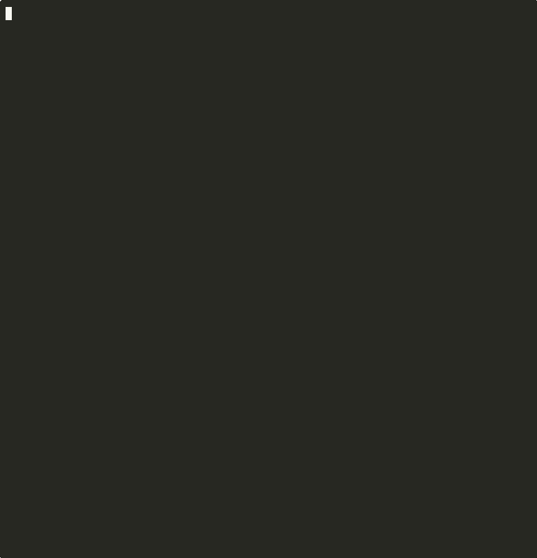

<div align="center">

<!-- SVG Banner -->
<svg xmlns="http://www.w3.org/2000/svg" width="900" height="200" viewBox="0 0 900 200">
  <defs>
    <linearGradient id="bg" x1="0%" y1="0%" x2="100%" y2="100%">
      <stop offset="0%" style="stop-color:#0a0a0a"/>
      <stop offset="100%" style="stop-color:#111827"/>
    </linearGradient>
    <linearGradient id="wire" x1="0%" y1="0%" x2="100%" y2="0%">
      <stop offset="0%" style="stop-color:#06b6d4"/>
      <stop offset="50%" style="stop-color:#8b5cf6"/>
      <stop offset="100%" style="stop-color:#06b6d4"/>
    </linearGradient>
    <filter id="glow">
      <feGaussianBlur stdDeviation="3" result="coloredBlur"/>
      <feMerge><feMergeNode in="coloredBlur"/><feMergeNode in="SourceGraphic"/></feMerge>
    </filter>
  </defs>
  <!-- Background -->
  <rect width="900" height="200" fill="url(#bg)" rx="12"/>
  <!-- Grid lines -->
  <line x1="0" y1="50" x2="900" y2="50" stroke="#1f2937" stroke-width="1"/>
  <line x1="0" y1="100" x2="900" y2="100" stroke="#1f2937" stroke-width="1"/>
  <line x1="0" y1="150" x2="900" y2="150" stroke="#1f2937" stroke-width="1"/>
  <line x1="150" y1="0" x2="150" y2="200" stroke="#1f2937" stroke-width="1"/>
  <line x1="300" y1="0" x2="300" y2="200" stroke="#1f2937" stroke-width="1"/>
  <line x1="600" y1="0" x2="600" y2="200" stroke="#1f2937" stroke-width="1"/>
  <line x1="750" y1="0" x2="750" y2="200" stroke="#1f2937" stroke-width="1"/>
  <!-- Animated wire line -->
  <line x1="60" y1="100" x2="840" y2="100" stroke="url(#wire)" stroke-width="2" filter="url(#glow)" opacity="0.6"/>
  <!-- Node dots -->
  <circle cx="150" cy="100" r="5" fill="#06b6d4" filter="url(#glow)"/>
  <circle cx="300" cy="100" r="5" fill="#8b5cf6" filter="url(#glow)"/>
  <circle cx="450" cy="100" r="8" fill="#06b6d4" filter="url(#glow)"/>
  <circle cx="600" cy="100" r="5" fill="#8b5cf6" filter="url(#glow)"/>
  <circle cx="750" cy="100" r="5" fill="#06b6d4" filter="url(#glow)"/>
  <!-- Main title -->
  <text x="450" y="68" font-family="'SF Mono', 'Fira Code', monospace" font-size="52" font-weight="900" fill="url(#wire)" filter="url(#glow)" text-anchor="middle" letter-spacing="12">WIRE</text>
  <!-- Subtitle -->
  <text x="450" y="136" font-family="'SF Mono', 'Fira Code', monospace" font-size="13" fill="#9ca3af" text-anchor="middle" letter-spacing="3">WORKFORCE INTELLIGENCE &amp; REASONING ENGINE</text>
  <!-- Tagline -->
  <text x="450" y="168" font-family="'SF Mono', 'Fira Code', monospace" font-size="11" fill="#4b5563" text-anchor="middle" font-style="italic">"Describe the work. WIRE hires the workforce."</text>
</svg>

<br/>

[](https://pypi.org/project/wire-ai)
[](https://www.python.org)
[](#)
[](LICENSE)
[](#adapters)

**The first framework-agnostic governance layer for autonomous enterprise AI agents.**  
Loop protection · Tamper-proof audit · HITL · SLA enforcement · SOC-2/HIPAA presets · Live dashboard

</div>

---

## The Problem

Every major agent framework ships without the things enterprises actually need:

```
LangGraph  → "very low-level, focused entirely on agent orchestration"  (their words)
AutoGen    → Studio "not meant to be used in a production environment"   (their docs)
CrewAI     → no idempotency guard — payments fire twice on task retry    (production bug)
AWS Bedrock → audit logging disabled by default                          (verified)
MS Foundry  → SLA enforcement: ❌  (117 adversarially-verified claims)
```

WIRE fixes every gap. Without replacing your framework.

---

## Install

```bash
pip install wire-ai                       # core + in-memory idempotency
pip install wire-ai[langgraph]            # + LangGraph adapter
pip install wire-ai[crewai]              # + CrewAI adapter
pip install wire-ai[autogen]             # + AutoGen adapter
pip install wire-ai[openai]              # + OpenAI Agents SDK adapter
pip install wire-ai[foundry]             # + Microsoft Foundry adapter
pip install wire-ai[web]                 # + FastAPI web dashboard
pip install wire-ai[slack]               # + Slack HITL routing
pip install wire-ai[semantic]            # + SBERT semantic HIRE matching
pip install wire-ai[redis]               # + Redis durable idempotency
pip install wire-ai[postgres]            # + Postgres audit + idempotency
pip install wire-ai[all]                 # everything
```

---

## 30-second demo

```python
import wire

# 1. Describe the workforce in plain language
workforce = wire.hire("""
    Monitor AWS costs every hour.
    Detect anomalies over $500.
    Open a Jira P1 if budget exceeded.
    Escalate to #ops-channel if no human responds in 30 minutes.
""")

# See what was assembled — readable by non-engineers
print(workforce.describe())
# WorkforceGraph
#   Intent : Monitor AWS costs every hour...
#   Roles  : 4  ·  Source: rule (confidence 87%)
#
#   ├─ cost_monitor      (monitoring)  SLA: max 120s, max $0.05  risk=low
#   ├─ anomaly_detector  (monitoring)  SLA: max 60s              risk=medium
#   ├─ ticket_creator    (execution)   [idempotent]              risk=medium
#   └─ human_escalator   (governance)  SLA: max 1800s            risk=high

# 2. Deploy on any framework with full governance
governed = wire.deploy(
    my_langgraph_graph,            # or CrewAI, AutoGen, OpenAI, Foundry
    backend="langgraph",
    max_iterations=50,             # LoopGuard: halt before runaway
    max_cost_usd=1.0,              # Budget: hard $1 ceiling
    hourly_budget_usd=0.25,        # Budget: $0.25/hour rolling
    audit_path="wire-audit.jsonl", # AuditChain: tamper-proof log
)

# 3. Subscribe to events
@governed.on(wire.EventKind.LOOP_BREACH)
async def alert(event):
    print(f"🚨 Loop breach: {event.data['iterations']} iterations")

# 4. Run
result = await governed.ainvoke({"messages": [...]})

# 5. Verify audit integrity
count = wire.AuditChain.verify("wire-audit.jsonl")
# ✓ 47 entries · chain intact · no tampering detected
```

---

## Live Dashboard

```bash
wire dashboard --port 8080 --audit wire-audit.jsonl
# Opens http://localhost:8080 — live workforce status for engineers and executives
```

<div align="center">

</div>

> The GIF above shows: **HIRE** assembling a workforce from plain language → **`wire audit`** verifying the tamper-proof chain → **`wire replay`** rewinding a past run step-by-step.
>
> *Record your own: `asciinema rec wire-demo.cast` then `bash demo.sh`*

---

## What WIRE Adds

| Primitive | What it does | Problem it solves |
|---|---|---|
| `LoopGuard` | Halts at N iterations or $X cost | Runaway agents exhausting API quota |
| `AuditChain` | SHA-256 hash-linked tamper-proof log | Mutable/unsigned logs — compliance blocker |
| `Budget` | Hard hourly/daily/total cost ceilings | Surprise API bills |
| `HITLGate` | First-class human approval with Slack routing | HITL re-implemented per project |
| `IdempotencyGuard` | Content-addressed dedup (Memory/SQLite/Redis/Postgres) | Payments/tickets firing twice on retry |
| `SLATracker` | Response time + cost + confidence enforcement | No SLA primitive in any framework or cloud |
| `PolicyEnforcer` | Read-only roles cannot write | No authority scope enforcement |
| `wire.hire()` | Plain-language → workforce assembly | Engineering required to configure agents |
| `WorkforceDashboard` | Live terminal + web UI | Black-box agents, no visibility |
| `DriftDetector` | Cross-session behavioural drift alerts | Silent behaviour changes after context compression |
| `TimeTravel` | Replay any past run from audit chain | No post-hoc debugging in any framework |
| `CompliancePreset` | SOC-2 / HIPAA / GDPR / NIST AI RMF in one line | Manual compliance configuration |
| `RBACPolicy` | Who can deploy, approve, audit | No access control on agent operations |
| `TenantRegistry` | Isolated namespaces per team/org | Multi-tenant agent governance |

---

## Adapters

Same `wire.deploy()` API across all five frameworks:

```python
# LangGraph
wire.deploy(compiled_graph,    backend="langgraph")

# CrewAI — fixes the documented double-fire bug on task retry
wire.deploy(crew,              backend="crewai")

# AutoGen — replaces unstable UserProxyAgent HITL blocking
wire.deploy({"a": agent, "p": proxy}, backend="autogen")

# OpenAI Agents SDK
wire.deploy(agent,             backend="openai")

# Microsoft Foundry — adds SLA + audit + idempotency Foundry lacks natively
wire.deploy(
    {"endpoint": "https://...", "agent_id": "asst_...", "credential": cred},
    backend="foundry",
)
```

---

## Durable Idempotency

Works across restarts and distributed deployments:

```python
from wire.core.idempotency_backends import SQLiteBackend, RedisBackend, PostgresBackend

# Survives restarts — single node
guard = wire.IdempotencyGuard(backend=SQLiteBackend("wire-idempotency.db"))

# Distributed — multi-process, multi-node, TTL expiry
guard = wire.IdempotencyGuard(backend=RedisBackend("redis://localhost:6379"))

# Enterprise — multi-tenant, SQL query, row-level security
guard = wire.IdempotencyGuard(backend=PostgresBackend(dsn="postgresql://...", tenant_id="team-a"))
```

---

## HITL — Slack Routing

```python
gate = wire.HITLGate(
    channel="slack:#ops-approvals",    # posts to Slack, waits for button click
    slack_token="xoxb-...",            # or set SLACK_BOT_TOKEN env var
    timeout_minutes=30,
    timeout_action=wire.TimeoutAction.ESCALATE,
)

# In your agent:
decision = await gate.request(
    run_id=run_id,
    message="Approve Jira P1 for $847 AWS anomaly?",
    context={"amount": 847, "region": "us-east-1"},
    risk=wire.Risk.HIGH,
)
```

Slack receives a rich Block Kit message with approve/reject/modify buttons. WIRE polls for the response and returns the decision with full audit trail.

---

## HIRE — Semantic Matching

Three-stage pipeline, no LLM cost on the happy path:

```
1. Rule-based   (keyword matching — fast, free, deterministic)
2. Semantic     (SBERT cosine similarity — if sentence-transformers installed)
3. LLM fallback (Claude haiku — only when confidence < threshold)
```

```python
# Synchronous — rule-based only, zero cost
workforce = wire.hire("monitor our AWS costs and open Jira on breach")

# Async — full three-stage pipeline
workforce = await wire.hire_async(
    "watch for unusual spend patterns in our cloud infrastructure",
    use_semantic=True,   # SBERT tier (pip install wire-ai[semantic])
    force_llm=False,
)
```

---

## Enterprise

```python
from wire.enterprise.compliance import CompliancePreset
from wire.enterprise.rbac import RBACPolicy, Actor, Permission
from wire.enterprise.multitenancy import Tenant, TenantRegistry
from wire.enterprise.blueprints import AgentBlueprint, BlueprintRegistry

# SOC-2 preset — auto-configures retention, encryption, HITL requirements
wire.deploy(graph, backend="langgraph",
            compliance=CompliancePreset.SOC2)

# RBAC — engineers deploy, managers approve, security reads audit
policy = RBACPolicy.default()
actor  = Actor(id="eng@company.com", groups=["wire-engineers"])
policy.require(actor, Permission.DEPLOY)   # passes
policy.require(actor, Permission.APPROVE_HITL)  # → PermissionDeniedError

# Multi-tenancy — isolated per team
registry = TenantRegistry()
registry.register(Tenant(id="team-vayu", name="Team Vayu", budget_daily_usd=10.0))

# Foundry agent identity blueprints
blueprints = BlueprintRegistry()
blueprints.register(AgentBlueprint(
    id="cost-monitor-v1",
    name="AWS Cost Monitor Agent",
    allowed_roles=["wire-engineers"],
    compliance_preset="soc2",
))
```

---

## Plugins

```python
from wire.plugins.agentlens_plugin import AgentLensPlugin
from wire.plugins.tokmon_plugin import TokmonPlugin

registry = wire.get_plugin_registry()
registry.register(AgentLensPlugin(api_url="http://localhost:8080"))
registry.register(TokmonPlugin(session_name="prod-run", budget_usd=5.0))

# All adapters emit automatically — zero code changes in agent logic
```

---

## Compliance Presets

| Preset | Retention | HITL Required For | Min Confidence | Data Restriction |
|---|---|---|---|---|
| `SOC2` | 365 days | HIGH, CRITICAL | 75% | — |
| `HIPAA` | 6 years | MEDIUM+ | 90% | US only · PHI prohibited |
| `GDPR` | 3 years | HIGH, CRITICAL | 80% | EU only · PII prohibited |
| `NIST_AI` | 2 years | HIGH, CRITICAL | 80% | — |

```python
wire.CompliancePreset.SOC2.summary()
# Compliance Preset: SOC-2 Type II
#   Audit retention  : 365 days
#   Encrypt at rest  : True
#   HITL required for: high, critical
#   Min confidence   : 75%
```

---

## Repo Structure

```
wire-ai/
├── src/wire/
│   ├── __init__.py            ← all public exports
│   ├── deploy.py              ← wire.deploy() entry point
│   ├── hire_api.py            ← wire.hire() / wire.hire_async()
│   │
│   ├── core/                  ← Sprint 1–2 governance primitives
│   │   ├── audit.py           ← AuditChain (SHA-256 hash-linked)
│   │   ├── budget.py          ← Budget (hourly/daily/total ceilings)
│   │   ├── guard.py           ← LoopGuard (iteration + cost limits)
│   │   ├── hitl.py            ← HITLGate (CLI + Slack + email)
│   │   ├── idempotency.py     ← IdempotencyGuard (pluggable backends)
│   │   ├── idempotency_backends.py  ← Memory / SQLite / Redis / Postgres
│   │   ├── policy.py          ← PolicyEnforcer (authority scope)
│   │   └── sla.py             ← SLATracker (response/cost/confidence)
│   │
│   ├── hire/                  ← Sprint 3 HIRE engine
│   │   ├── parser.py          ← 3-stage: rule → semantic → LLM
│   │   ├── semantic.py        ← SBERT cosine similarity matching
│   │   ├── templates.py       ← 20 built-in role templates
│   │   └── workforce.py       ← WorkforceGraph + describe() + to_yaml()
│   │
│   ├── adapters/              ← Sprint 5 + v1.1 framework adapters
│   │   ├── langgraph.py       ← LangGraph CompiledGraph wrapper
│   │   ├── crewai.py          ← CrewAI Crew wrapper (fixes double-fire)
│   │   ├── autogen.py         ← AutoGen team wrapper (fixes HITL blocking)
│   │   ├── openai.py          ← OpenAI Agents SDK wrapper
│   │   └── foundry.py         ← Microsoft Foundry AgentsClient wrapper
│   │
│   ├── channels/              ← HITL routing channels
│   │   └── slack.py           ← Slack Block Kit + polling
│   │
│   ├── visibility/            ← Sprint 4 observability
│   │   ├── dashboard.py       ← Live terminal UI (Rich/Live)
│   │   ├── web_dashboard.py   ← FastAPI + SSE web dashboard
│   │   ├── drift.py           ← DriftDetector (cross-session)
│   │   ├── ledger.py          ← CostLedger (per-role/run/model)
│   │   └── replay.py          ← TimeTravel (audit chain replay)
│   │
│   ├── enterprise/            ← Sprint 6 enterprise tier
│   │   ├── compliance.py      ← SOC-2 / HIPAA / GDPR / NIST AI RMF
│   │   ├── rbac.py            ← RBACPolicy + Actor + Permission
│   │   ├── multitenancy.py    ← TenantRegistry + Tenant
│   │   ├── backends.py        ← S3 + Postgres audit backends
│   │   └── blueprints.py      ← Foundry agent identity blueprints
│   │
│   └── plugins/               ← Plugin connectors
│       ├── agentlens_plugin.py  ← AgentLens runtime profiling
│       └── tokmon_plugin.py     ← Tokmon token/cost tracking
│
├── tests/                     ← 409 tests, 6 skipped
├── examples/                  ← Sprint 1–5 usage examples
└── pyproject.toml             ← optional extras per feature
```

---

## Setup

### Prerequisites
- Python 3.11+
- An agent framework (LangGraph, CrewAI, AutoGen, OpenAI, or Foundry)

### Quick start

```bash
# 1. Install
pip install wire-ai

# For your specific framework:
pip install wire-ai[langgraph]   # LangGraph
pip install wire-ai[crewai]      # CrewAI
pip install wire-ai[autogen]     # AutoGen
pip install wire-ai[openai]      # OpenAI Agents SDK
pip install wire-ai[foundry]     # Microsoft Foundry

# 2. Wrap your existing agent (5 lines)
import wire

workforce = wire.deploy(
    your_existing_graph_or_crew,
    backend="langgraph",           # or "crewai", "autogen", "openai", "foundry"
    max_iterations=50,
    max_cost_usd=1.0,
)
result = await workforce.ainvoke({"messages": [...]})

# 3. Verify your first audit chain
wire audit wire-audit.jsonl
# ✓ 12 entries · chain intact

# 4. Start the web dashboard
wire dashboard
# → http://localhost:8080
```

### For the full enterprise stack

```bash
pip install "wire-ai[all]"

# Optional extras:
pip install "wire-ai[semantic]"   # SBERT semantic HIRE (needs torch)
pip install "wire-ai[redis]"      # Distributed idempotency
pip install "wire-ai[postgres]"   # Enterprise audit backends
pip install "wire-ai[slack]"      # Slack HITL routing
pip install "wire-ai[web]"        # Web dashboard
```

### Environment variables

```bash
SLACK_BOT_TOKEN=xoxb-...          # Slack HITL routing
ANTHROPIC_API_KEY=sk-ant-...      # HIRE engine LLM fallback
AWS_DEFAULT_REGION=us-east-1      # S3 audit backend
```

### Development setup

```bash
git clone https://github.com/naveenkumarbaskaran/wire-ai
cd wire-ai
python -m venv .venv && source .venv/bin/activate
pip install -e ".[dev]"
pytest tests/                     # 409 passed, 6 skipped
```

---

## CLI

```bash
wire version                             # v1.2.0
wire status                              # installed adapters + plugin status
wire audit [path]                        # verify audit chain integrity
wire replay --run-id <id> [path]         # replay a past workforce run
wire dashboard [--port 8080] [--audit]   # start web dashboard
```

---

## Competitive Position

Research basis: 2 parallel deep-research passes · 212 adversarially-verified claims · 214 agent calls

| | LangGraph | CrewAI | AutoGen | AWS Bedrock | MS Foundry | **WIRE** |
|---|:---:|:---:|:---:|:---:|:---:|:---:|
| Framework-agnostic | ❌ | ❌ | ❌ | ❌ | ❌ | ✅ |
| Plain-language HIRE | ❌ | ❌ | ❌ | ❌ | ❌ | ✅ |
| SLA enforcement | ❌ | ❌ | ❌ | ❌ | ❌ | ✅ |
| Tamper-proof audit | ❌ | ❌ | ❌ | Partial | ❌ | ✅ |
| HITL first-class | Partial | ❌ | Unstable | ❌ | ✅ | ✅ |
| Loop containment | ❌ | ❌ | ❌ | ❌ | ❌ | ✅ |
| Idempotency guard | ❌ | ❌ | ❌ | ❌ | ❌ | ✅ |
| Live dashboard | ❌ | ❌ | ❌ | Partial | Partial | ✅ |
| SOC-2/HIPAA presets | ❌ | ❌ | ❌ | ❌ | ❌ | ✅ |
| RBAC | ❌ | ❌ | ❌ | ❌ | ✅ | ✅ |

> SLA enforcement is **absent from every cloud platform** as of 2026 — confirmed 3-0 adversarial vote across AWS Bedrock, Google Vertex AI, and Microsoft Foundry.

---

## Built by

**Naveen Kumar Baskaran** — [@naveenkumarbaskaran](https://github.com/naveenkumarbaskaran)

WIRE assembles the governance layer from across the entire ecosystem:
[agentlens](https://github.com/naveenkumarbaskaran/agentlens) ·
[tokmon](https://github.com/naveenkumarbaskaran/tokmon) ·
[AgentGuard](https://github.com/naveenkumarbaskaran/AgentGuard) ·
[agent-gateway](https://github.com/naveenkumarbaskaran/agent-gateway) ·
[TokenShield](https://github.com/naveenkumarbaskaran/TokenShield) ·
[context-budget](https://github.com/naveenkumarbaskaran/context-budget)

---

<div align="center">

**MIT License** · [PyPI](https://pypi.org/project/wire-ai) · [Issues](https://github.com/naveenkumarbaskaran/wire-ai/issues)

*The most governance-complete agent framework layer in the ecosystem.*

</div>
